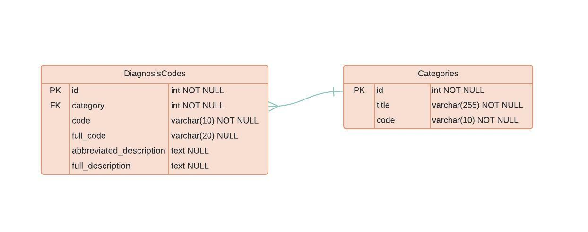

# Diagnosis-Code-Api
Backend Engineer Take Home Test

## Problem Description
Build a RESTful API that can allow a firm to utilize an internationally recognized set of diagnosis codes.

**NB:** All the API endpoints should respond within 100ms

## Features
* API to Create, Update and Delete diagnosis code records
* API to List all records 
* API to retrieve the details of a diagnosis code record
* API for uploading file to create multiple diagnose code records
* Email notification to alert users when multiple records creation by file upload is successful

## Technologies Used
* Python
    - Django
    - Django Rest Framework
    - Celery
* PostgreSQL
* Docker
* Redis

## Database Schema


## Architectural Consideration
1. The ```full_code``` of the ```DiagnosisCode``` Model is simply the ```category code``` and the ```code``` of the ```DiagnosisCode``` Model concatenated. The ```full_code``` is populated with the data of these two fields automatically and saved into the database.

2. Each DiagnosisCode object has a category field which is foreign key relating to th CategoryCode Model, The Category Model provides the categoryTitle and categoryCode fields for the DiagnosisCode Model

## Setup Instructions
To run this project
1. Clone project
2. Build and run docker container with a single command: docker-compose up —build


## Migration and Populating the database with initial data
Open a new terminal and run:
```
docker ps
docker exec -it <CONTAINER_NAME> bash
python manage.py makemigrations api_v1
python manage.py migrate
python manage.py loaddata diagnosis_code_data.json
```


